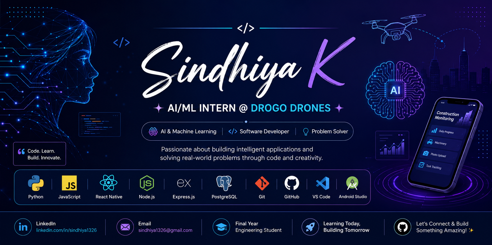

  

<h1 align="center">Hi 👋, I'm Sindhiya K</h1>

<h3 align="center">
AI/ML Intern @ Drogo Drones | Aspiring AI & Software Engineer
</h3>

Building AI-powered solutions • Mobile Applications • Continuous Learner

---

# 👩‍💻 About Me

- 🎓 Final Year Engineering Student
- 🚀 AI/ML Intern @ **Drogo Drones**
- 📱 Building a Construction Monitoring Mobile Application
- 🤖 Passionate about Artificial Intelligence & Machine Learning
- 💡 Interested in Software Engineering & Mobile Development
- 🌱 Currently learning React Native, AI/ML & Backend Development

---

# 🚀 Tech Stack

---

# 🚀 Current Focus

- 📱 React Native Development
- 🤖 Artificial Intelligence
- 📊 Machine Learning
- 🔗 REST APIs
- 🗄 PostgreSQL
- ☁ Backend Development

---

# 📊 GitHub Stats

---

# 🔥 GitHub Streak

---

# 📈 Contribution Graph

---

# 📌 Featured Projects

## 📱 Construction Monitoring Mobile App

- Daily Progress Reports
- Machinery Usage
- Task Tracking
- React Native + Node.js + PostgreSQL

---

## 🤖 AI & Machine Learning

Projects related to:

- Machine Learning
- Data Analysis
- Python
- Recommendation Systems

---

# 🎯 Goals

- 🚀 Become an AI Engineer
- 📱 Build impactful software products
- 🌍 Contribute to Open Source
- 📚 Keep learning every day

---

# 📫 Connect With Me

📧 **Email:** sindhiya1326@gmail.com

💼 **LinkedIn:** https://www.linkedin.com/in/sindhiya1326

⭐ *"Every project is an opportunity to learn, improve, and create something meaningful."*
